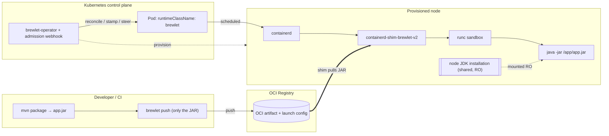

# Brewlet documentation

**Run Java applications on Kubernetes the way you run WebAssembly — ship just your
app (a fat JAR, a layered classpath, or a module), no Dockerfile, no base image.**

This directory is the complete, task-oriented documentation for Brewlet. If you
want the elevator pitch and the "why", start with the [project README](../README.md);
if you want the deep architecture and design rationale, read the
[SPECIFICATION](https://github.com/brewlet/specs/blob/main/SPECIFICATION.md). These pages sit in between: they tell you how
to actually **install, configure, deploy, tune, and operate** Brewlet.

Brewlet is a multi-repository project. Runtime commands in these guides refer to
[`brewlet/brewlet`](https://github.com/brewlet/brewlet), Kubernetes resources to
[`brewlet/kubernetes`](https://github.com/brewlet/kubernetes), Maven goals to
[`brewlet/maven-plugin`](https://github.com/brewlet/maven-plugin), architecture
contracts to [`brewlet/specs`](https://github.com/brewlet/specs), and runnable
examples to
[`brewlet/integration-tests`](https://github.com/brewlet/integration-tests).

> ⚠️ **Status.** Brewlet has a working implementation spanning Phases 0–3
> (artifact format, containerd shim, Helm packaging, operator, `JavaApplication`
> CRD, `brewlet` CLI, Maven plugin, AppCDS, and multi-arch scheduling). It is **not
> production-ready**. Where a page documents intended behavior that is not yet
> implemented, it says so explicitly.

---

## Where to start

| If you are a… | Start here |
|---|---|
| **Developer** shipping a Java service | [Building & publishing application artifacts](building-and-publishing.md) → [Deploying workloads](deploying-workloads.md) |
| **Platform / cluster operator** enabling Brewlet on a cluster | [Installation](installation.md) → [Configuration](configuration.md) → [JDK management](jdk-management.md) |
| **Anyone** who wants to try it locally in minutes | [Getting started (local PoC)](getting-started.md) |
| **Someone evaluating** the idea | [Concepts & architecture](concepts.md) |

---

## Table of contents

### Understand it
- **[Concepts & architecture](concepts.md)** — the model, the KWasm parallel, the
  component inventory, and the end-to-end build/run flow.

### Try it
- **[Getting started (local PoC)](getting-started.md)** — build the demo JAR, push
  it as an OCI artifact, run it, and exercise the real `shim → runc → java -jar`
  path under cgroups.
- **[Example: Spring PetClinic](spring-petclinic.md)** — the same flow with the
  **real upstream Spring Boot app**: build the fat JAR, ship only the JAR, run it
  via `shim → runc` under cgroups, and deploy it as a `JavaApplication`.

### Run it on a cluster
- **[Installation](installation.md)** — prerequisites, the KWasm-style `helm
  install`, the manual (no-Helm) path, and how to verify the fleet is ready.
- **[Configuration](configuration.md)** — every knob: Helm values, provisioner
  env vars, operator/admission flags, the RuntimeClass, and precedence rules.
- **[JDK management](jdk-management.md)** — installing, versioning, patching, and
  multi-arch JDK runtime roots on nodes (copy-from-image).
- **[Launchers](launchers.md)** — vanilla `java` vs. `jaz`, installing launcher
  layers, choosing one, and how launcher selection is resolved.

### Ship workloads
- **[Building & publishing application artifacts](building-and-publishing.md)** — build a
  fat JAR (or a layered classpath app), author the launch config, and push it with the `brewlet` CLI or ORAS.
- **[Deploying workloads](deploying-workloads.md)** — the raw `Deployment` path,
  the `JavaApplication` CRD, and requesting a specific JDK/launcher via annotations.
- **[Resource limits & JVM tuning](resource-tuning.md)** — how CPU/memory limits
  become cgroup constraints and how the container-aware JVM (and `jaz`) react.

### Operate it
- **[Security](security.md)** — isolation model, non-root defaults, supply-chain
  verification, and the sharp edge of privileged node provisioning.
- **[Observability & day‑2](observability.md)** — networking, logs, metrics,
  probes, JDK upgrades, and multi-arch operations.
- **[Troubleshooting](troubleshooting.md)** — failure modes, what they look like,
  and how to fix them.

### Reference
- **[CLI reference](cli-reference.md)** — `brewlet push / inspect / run / bundle / jdks`.
- **[Reference](reference.md)** — labels & annotations, OCI media types, the
  artifact & launch-config schema, well-known paths, and a glossary.
- **[JPMS support](jpms-support.md)** — how Brewlet runs modular
  (JPMS) apps on the module path rather than only fat JARs; `entry.mode: module` and the
  optional module/classpath layer.
- **[Layered classpath deployment](layered-classpath-deployment.md)** —
  splitting an app into stable dependency layers + a thin app layer for registry
  dedup and faster pulls; the `classpath.layer.v1+tar` layer and `entry.classPath`.
- **[Runnable-image delivery](runnable-image.md)** — `brewlet push --format=image`
  publishes the JAR as a standard, kubelet-pullable OCI image so a
  `runtimeClassName: brewlet` pod can set `image: <ref>` and let kubelet pull +
  unpack it (the WASI/KWasm pull path), instead of custom media types that
  `ImagePullBackOff`.

#### Phase 3 — hardening & speed ✅ implemented / Phase 4 — remaining (research)

Design notes for the [hardening & speed roadmap](https://github.com/brewlet/specs/blob/main/SPECIFICATION.md#15-phased-roadmap)
items — whether each capability fits Brewlet, how to surface it, what it touches,
and how to implement it. **AppCDS and multi-arch (Phase A) now ship (Phase 3);** the
rest remain research for Phase 4:

- **[AppCDS](appcds.md)** ✅ *(Phase 3, shipped)* — Application Class-Data Sharing for
  faster startup: the free base-CDS win, the shippable archive layer, node-side
  regeneration, and the JDK-coupling problem.
- **[Multi-arch fleets](multi-arch.md)** ✅ *(Phase 3, Phase A shipped)* — the
  arch-neutral-artifact advantage and the shipped `arch` constraint for non-portable
  (JNI) JARs; Phase B (coverage observability + accelerator guardrails) remains research.
- **[Supply-chain verification (cosign/SLSA)](supply-chain-admission.md)** *(Phase 4)* —
  verifying artifact signatures/provenance at admission (digest-keyed), via a
  policy engine or an optional fail-closed Brewlet webhook.
- **[Sandbox runtimes (gVisor/Kata)](sandbox-runtimes.md)** *(Phase 4)* — stronger
  isolation tiers for untrusted JARs; gVisor as a drop-in `runsc` swap vs. Kata's deeper
  tradeoffs.
- **[Metrics exporter](metrics-exporter.md)** *(Phase 4)* — Brewlet-specific runtime
  telemetry (cold-start phases, JDK inventory/patch age, admission outcomes) as Prometheus.

#### Enhancement proposals

- **[Proposals index](https://github.com/brewlet/specs/tree/main/proposals)** — KEP-style design docs for larger
  changes, reviewed before they land in the spec and absorbed into it once implemented.
  - **[0001 — Node profiles](https://github.com/brewlet/specs/blob/main/proposals/0001-node-profiles.md)** *(Implemented)* — a cluster-scoped
    `NodeProfile` CRD that maps a **node pool** to a JDK/launcher inventory
    (heterogeneous per-pool inventories, autoscaler-safe opt-in, finalizer-based
    cleanup, an immutable-image mode); absorbed into §5.6.
  - **[0002 — Validated node reconfig](https://github.com/brewlet/specs/blob/main/proposals/0002-validated-node-reconfig.md)** *(Partially implemented)* —
    validated containerd reconfiguration + a readiness smoke gate. The smoke gate and
    restart-mode knob ship; the reversible `config dump` + `systemctl restart` and
    launcher probe remain.
  - **[0003 — Capability-label taxonomy](https://github.com/brewlet/specs/blob/main/proposals/0003-capability-label-taxonomy.md)** *(Draft)* —
    the `brewlet.sh/jdk.*` scheduling labels as a stable, autoscaler-friendly contract.
  - **[0004 — cert-manager admission](https://github.com/brewlet/specs/blob/main/proposals/0004-cert-manager-admission.md)** *(Draft)* —
    cert-manager for the admission webhook's serving cert.

#### Future direction — multi-runtime (research)

- **[Multi-runtime support: .NET](dotnet-runtime-support.md)** — why .NET
  (framework-dependent) is the best second runtime family after Java, a fit analysis
  vs. Node.js/Python, and how to generalize the artifact/provisioner/shim/admission/CRD
  design (§4–§9) without forking the Java path.

---

## How the pieces fit together (one diagram)

See [Concepts & architecture](concepts.md) for the full walkthrough.
