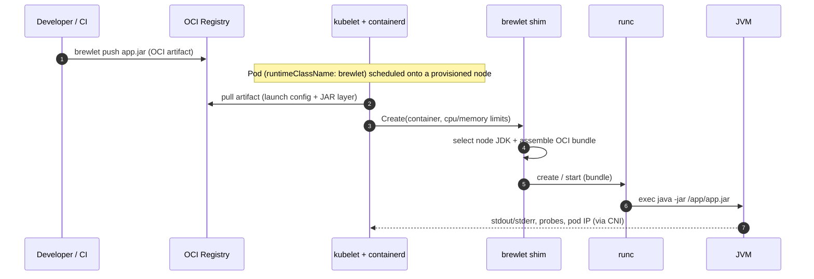

# Concepts & architecture

This page explains the Brewlet model, the components that implement it, and the
end-to-end flow from `mvn package` to a running JVM on a node. For the full design
rationale and every edge case, see the [SPECIFICATION](https://github.com/brewlet/specs/blob/main/SPECIFICATION.md).

---

## The core idea

Shipping a Java service to Kubernetes today forces every developer to also become a
**container author**: pick a base image, write a `Dockerfile`, patch an OS layer,
keep a JVM baked into every image, and push hundreds of megabytes — to deliver an
artifact that is, in reality, a single self-executable (fat/uber) JAR.

WebAssembly already solved this. With [KWasm](https://kwasm.sh/), the Wasm
*runtime* lives on the node, the developer ships only a `.wasm` module as an OCI
artifact, and a `RuntimeClass` tells Kubernetes to execute it. No Dockerfile, no
base image.

**Brewlet brings that exact model to the JVM.** You publish **your Java application** —
most often a single `app.jar`, but just as well a layered classpath app or a
JPMS module — as an OCI artifact. A node-resident JDK runs it (e.g. the canonical
`java -jar app.jar`), inside a runc sandbox whose CPU/memory limits come from the
Kubernetes deployment descriptor.

| You stop owning… | Because… |
|---|---|
| Dockerfiles | there is no image build — you push the JAR itself |
| OS base layers & their CVEs | there is no OS layer in the artifact |
| A JVM copy in every image | the JDK installation lives on the node, shared and patched centrally |
| Multi-hundred-MB pushes | only the JAR moves over the wire |
| Per-arch image builds & manifest lists | a JAR is JVM **bytecode — architecture-neutral**, so the *same* artifact runs on any provisioned arch (`amd64`/`arm64`); the node-side JDK is per-arch |

One JDK upgrade on the node pool patches **every** workload at once.

> **Cross-arch for free — with one exception.** Because a JAR is arch-neutral, a
> mixed `amd64`/`arm64` fleet needs no per-arch artifact. The exception is a
> **non-portable JAR** that bundles JNI native libraries (e.g. `netty-tcnative`,
> RocksDB); set its optional `arch` constraint so it schedules only onto
> compatible nodes. See [multi-arch fleets & non-portable JARs](multi-arch.md).

---

## The KWasm parallel (what Brewlet copies)

| Concern | KWasm (Wasm) | Brewlet (JVM) |
|---|---|---|
| Developer artifact | `.wasm` module as OCI artifact | `app.jar` as OCI artifact |
| Runtime location | Wasm runtime on the node | JDK/JVM distribution on the node |
| Node enablement | privileged provisioner DaemonSet installs shim | privileged provisioner DaemonSet installs shim + JDK |
| Execution routing | `RuntimeClass` → containerd shim | `RuntimeClass` → containerd shim |
| Container build needed? | no | no |
| Operator | `kwasm-operator` provisions nodes | `brewlet-operator` provisions nodes (+ reconciles CRD) |

Brewlet deliberately keeps **container-grade isolation** (runc) while adopting the
**Wasm-grade developer experience** (ship only the payload).

---

## Component inventory

Brewlet is a small set of cooperating pieces. Each maps to a directory in
[``](https://github.com/brewlet/brewlet/blob/main/) and a section of the spec.

| Component | What it does | Where |
|---|---|---|
| **OCI application artifact** | A Java application packaged as an OCI artifact (custom media types) — a fat JAR, or an app split into classpath layers — plus a small JSON launch config — *not* a runnable container image. | [`internal/artifact/`](https://github.com/brewlet/brewlet/tree/main/internal/artifact/), spec §4 |
| **`brewlet` CLI** | Developer/ops tool: `push`, `inspect`, `run`, `bundle`, `jdks`. | [`cmd/brewlet/`](https://github.com/brewlet/brewlet/tree/main/cmd/brewlet/) |
| **`containerd-shim-brewlet-v2`** | containerd Runtime v2 shim. On `Create` it disassembles the artifact, selects a node JDK, assembles an overlay-rootfs `java -jar` sandbox, and delegates to runc. | [`shim/`](https://github.com/brewlet/brewlet/tree/main/shim/), spec §6 |
| **`brewlet-node-provisioner`** | Privileged DaemonSet. On opted-in nodes it installs the shim, materializes JDK roots + launcher layers, registers the containerd runtime, and labels the node ready. | [`provisioner/`](https://github.com/brewlet/kubernetes/tree/main/provisioner/), spec §5 |
| **`brewlet-operator`** | Node lifecycle controller. Watches opted-in nodes, manages the provisioner DaemonSet + the `brewlet` RuntimeClass, and tracks node readiness. | [`operator/`](https://github.com/brewlet/kubernetes/tree/main/operator/), spec §8.1 |
| **`brewlet-admission`** | Mutating+validating webhook. Stamps the artifact ref/digest onto brewlet pods and matches/steers requested JDK/launcher onto compatible nodes. | [`operator/cmd/admission/`](https://github.com/brewlet/kubernetes/tree/main/operator/cmd/admission/), spec §8.3 |
| **`RuntimeClass/brewlet`** | Routes pods to the shim handler; its `nodeSelector` keeps workloads on ready nodes. | [`deploy/runtimeclass.yaml`](https://github.com/brewlet/kubernetes/blob/main/deploy/runtimeclass.yaml), spec §7 |
| **`JavaApplication` CRD** | The higher-level developer-facing deployment descriptor, reconciled by the operator's `JavaApplication` controller (§8.2). | [`deploy/javaapplication-crd.yaml`](https://github.com/brewlet/kubernetes/blob/main/deploy/javaapplication-crd.yaml), spec §9 |
| **Helm chart** | KWasm-style single-command activation of the operator + provisioner RBAC + webhook. | [`charts/brewlet/`](https://github.com/brewlet/kubernetes/tree/main/charts/brewlet/) |

---

## High-level architecture

```
 Developer / CI                  Control Plane                 Worker Node (provisioned)
 ───────────────                 ─────────────                 ─────────────────────────
  mvn package                ┌──────────────────────┐
  brewlet push ──► Registry  │  brewlet-operator     │  watches  ┌──────────────────────┐
                    │        │  + admission webhook  │ ────────► │  containerd + shim    │
                    │        └──────────┬───────────┘  annotate  │        │ runc         │
                    │                   │ generates              │        ▼              │
                    │           ┌───────────────────┐  scheduled │  ┌────────────────┐   │
                    │           │ Deployment / Pod  │ ─────────► │  │ Sandbox        │   │
                    │           │ runtimeClassName: │            │  │ (cgroup+netns) │   │
                    │           │   brewlet         │            │  │  java -jar     │   │
                    │           └───────────────────┘            │  │  /app/app.jar  │   │
                    └────────── shim pulls OCI artifact ───────► │  │  (node JDK RO) │   │
                                                                 │  └────────────────┘   │
                                                                 └──────────────────────┘
```

---

## End-to-end flow

### Build time (developer / CI)

1. Build your fat JAR as usual — `mvn package` / `gradle bootJar`. Nothing
   Brewlet-specific.
2. Push it as an **OCI artifact** with custom media types plus a tiny JSON *launch
   config* (main JAR, entry mode, app-intrinsic launch knobs). No image, no Dockerfile.
   See [Building & publishing](building-and-publishing.md).

### Run time (cluster)

3. The **node provisioner** (privileged DaemonSet, KWasm-style) installs the shim
   and one or more **JDK runtime roots** onto opted-in nodes, then labels them
   ready. See [JDK management](jdk-management.md).
4. A pod with `runtimeClassName: brewlet` is admitted: the **admission webhook**
   stamps the artifact ref/digest and steers it (via `nodeAffinity`) onto a node
   with a compatible JDK/launcher.
5. The **containerd shim** disassembles the artifact, selects the matching
   node-resident JDK, assembles an OCI runtime bundle (JDK mounted read-only + JAR
   at `/app`, `process.args = ["java","-jar","/app/app.jar"]`, cgroup limits from
   the pod), and hands it to **runc**.
6. The JVM runs as a normal pod: real pod IP via CNI, `kubectl logs`/`exec`, probes,
   HPA, and Services all work unchanged.



---

## Why runc-backed?

The shim is **runc-backed on purpose**: rather than re-implementing namespaces,
cgroups, seccomp/AppArmor, and CNI, it *assembles an OCI runtime bundle and
delegates isolation to runc* (the same approach [runwasi](https://github.com/containerd/runwasi)
takes for Wasm). The only novel code is *artifact → bundle → args*. Consequently:

- Probes (`exec`, `httpGet`, `tcpSocket`), `kubectl exec`, ephemeral debug
  containers, and metrics-server behave normally.
- The pod gets a real pod IP via the CNI-provided netns.
- CPU/memory limits are enforced as ordinary cgroup v2 constraints.

---

## What Brewlet does *not* do

- It does **not** replace OCI images for apps that legitimately need OS packages or
  native dependencies. Brewlet is additive: it only handles pods that opt in via
  `runtimeClassName: brewlet`; everything else runs normally.
- It does **not** build your application (that's CI's job) — it only *runs* it.
- It is **not** a polyglot runtime — JVM only for v1.
- It injects **no** JVM tuning flags of its own. See [Resource tuning](resource-tuning.md).

---

## Next steps

- Try it locally: [Getting started](getting-started.md).
- Enable it on a cluster: [Installation](installation.md).
- Ship a workload: [Building & publishing](building-and-publishing.md) →
  [Deploying workloads](deploying-workloads.md).
